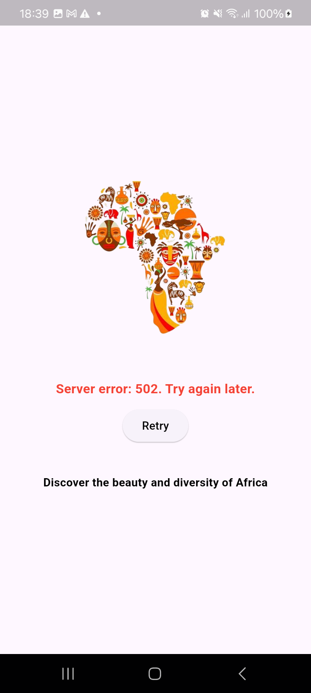
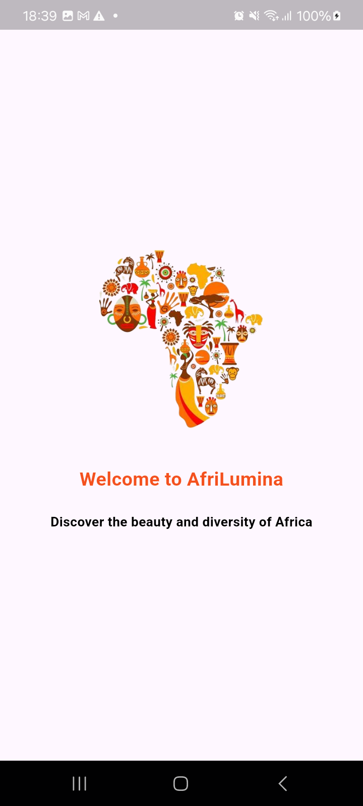
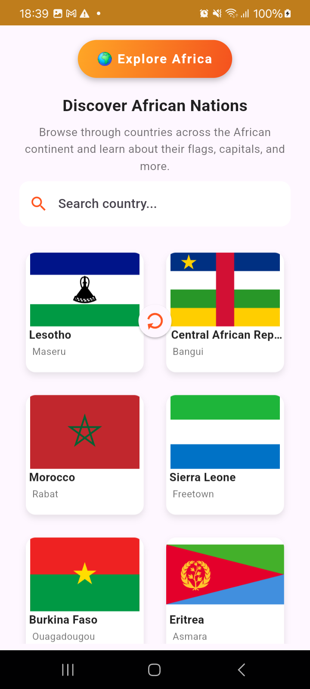
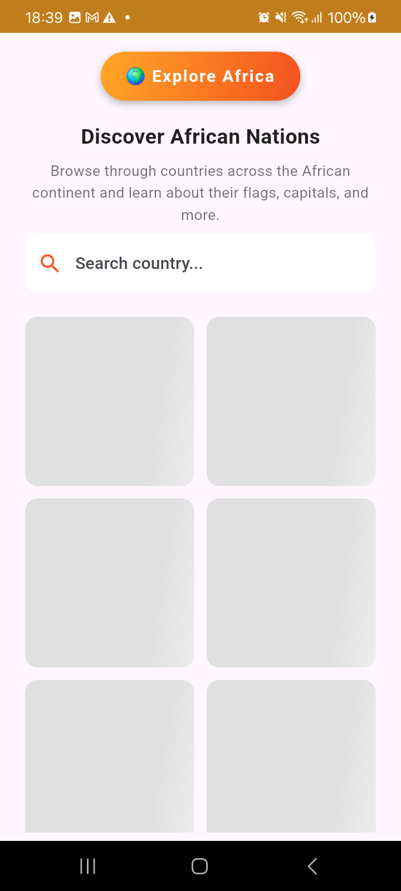
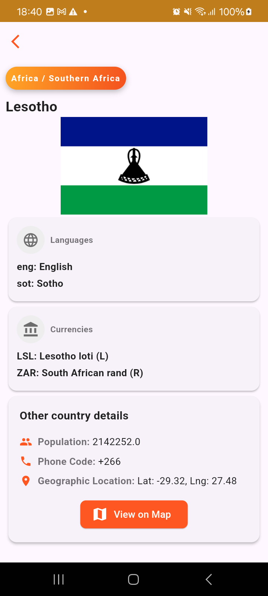
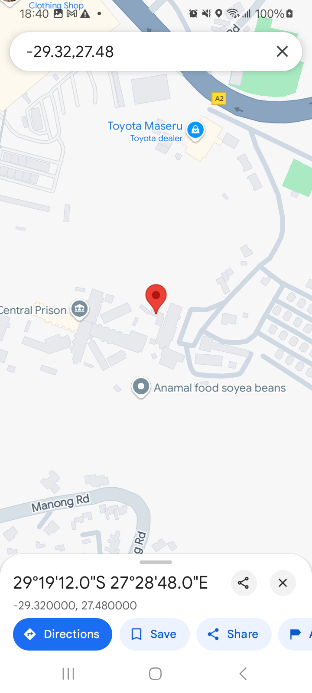
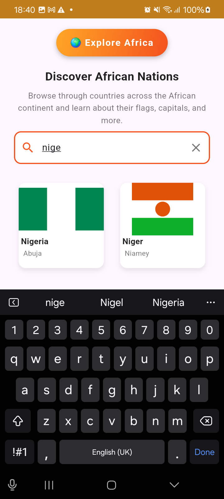

Afri Lumina 🚀
Welcome to Afri Lumina – Explore and Discover Africa! 🌍✨

🔍 Overview
Afri Lumina allows you to:

- Search for your favorite country and view details about their population, capital city, and even access their location on Google Maps.
- See the national flag of your favorite country.
- Scroll down to refresh the country list and get the latest data.

🛠️ How to Run
To get the app running, here’s what you need to know:

| Requirement | Version |
|------------|---------|
| Flutter | >=3.24.0 |
| Android Studio | Jellyfish 2023.3.1 Patch 2 or VS Code |

🌟 Features Overview

- **Splash Screen**: The splash screen welcomes you to the app as countries load in the background.
- **Search Functionality**: You can search for your favorite country.
- **Detailed Country View**: Click on a country to view more details.
- **Google Maps Integration**: Toggle to maps to view the country location.
- **Pull to Refresh**: Scroll down to refresh and update country details in real-time.

📌 **Error Handling**

Error handling is catered for expected network errors and hiccups opening the maps. Afri Lumina utilizes `try-catch` and a dedicated error widget to manage failures gracefully.

📸 **Screenshots and Demo**
Here’s a glimpse of Afri Lumina in action:

🎯 **Conclusion**
Afri Lumina is your ultimate guide to discovering Africa. Explore, learn, and navigate with ease!
